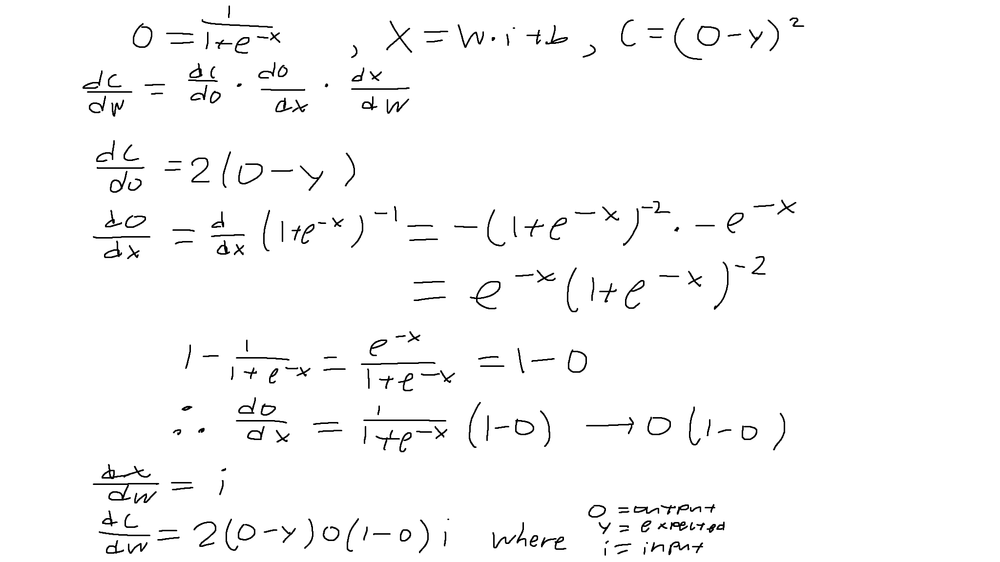
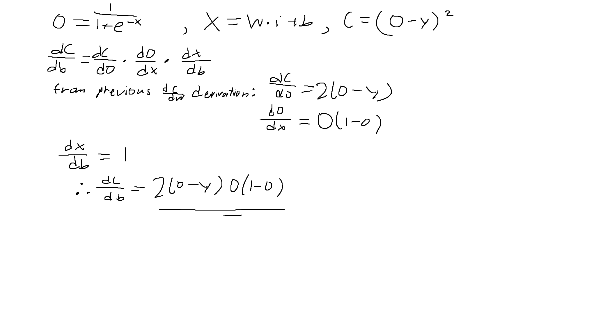

# Simple Perceptron
#### Video Demo:  <https://youtu.be/-0wIaHgIVPE>
#### Description:
This is a simple perceptron which accepts inputs (and expected values) and applies weights to them. Then, it sums up the weights and adds bias.  
Then, it's run through a sigmoid function to squash the value of the sum to be between 0 and 1. We want the output to be squashed so that it can be compared to our expected value (which is a value from 0 to 1).

The purpose of this project was to explore machine learning at a simple level that was achievable with no machine learning libraries needed.

The only requirements are numpy and matplotlib.
Numpy is extremely useful since numpy arrays act like vectors and so it's much easier to do operations on each specific element of an array rather than having to write a long for-loop. Additionally, it's also very useful for calculating the sum through finding the dot product of the weights array and the inputs array.
Matplotlib is used for graphically representing the changes in cost for the perceptron.

---

First, the user inputs a learning rate (how fast or slow the perceptron changes its weight and bias), then they input the number of inputs (the number of parameters).
The way that inputs are formatted is: [input input input expected]; the last digit is the expected value. Sets of training data are separated by commads.
Next, the user inputs the number of epochs (training cycles).

When the perceptron is trained, inputs and expected values are given to the train function, when then gives the inputs to the feed function, which returns the sum of the inputs multiplied by the weights (with the bias added onto it) after it has gone through the sigmoid function.

The sigmoid function is simply:

$$
O = \frac{1}{1 + e^{-x}}
$$

Where
$$
x = W \cdot i + b
$$
It's needed to make the value of the sum be between 0 and 1 so that we can use this to compare with the expected value later.


The cost (or mean-squared error) is calculated through:

$$
C = (O - Y)^2
$$

The gradient for cost w.r.t. weight is:

$$
\frac{dC}{dW} = 2 \cdot (O - Y) \cdot O \cdot (1 - O) \cdot i
$$

Because cost is a function of the weight, the gradient is $dC/dW$. The derivation of this is quite lengthy, but essentially you're finding $dC/dW$ from the chain rule:

$$
\frac{dC}{dW} = \frac{dC}{dO} \cdot \frac{dO}{dX} \cdot \frac{dX}{dW}
$$

We have to calculate different gradients w.r.t. cost and bias and can't use the same one (1st because $dC/dW$ is different from $dC/db$ and 2nd because input is a numpy array so when we multiply input, the result acts like a vector and would create multiple lines in the graph which we don't want happening).  

  

The gradient for cost w.r.t. bias is:


$$
\frac{dC}{db} = 2 \cdot (O - Y) \cdot O \cdot (1 - O)
$$



We find the gradient so that we can go in the opposite direction to reduce the cost. At the point where cost is 0, the gradient will also be 0 (a minimum point). Therefore, if we go against the gradient, eventually, the perceptron will optimise its weights and bias until its cost is near 0 (where the gradient is very small).
If the perceptron overestimates or underestimates the output, then the weights and bias will be adjusted accordingly:

$$
\text{self.weights} -= \text{wGrad} \cdot \text{input} \cdot \text{learningRate}
$$

$$
\text{self.bias} -= \text{bGrad} \cdot \text{learningRate}
$$

This is what enables the perceptron to "learn".  
It basically just changes its weights and bias based on that equation until its cost is minimized.  
The equations work for multiple weights because of the magic of numpy arrays (they just do subtraction and addition as if the arrays were vectors).

---

A graph is drawn using matplotlib, showing average cost and epoch (training cycles).  
Every cycle, the perceptron is trained and then each cycle's total cost is averaged and graphed:

$$
\text{Average Cost} = \frac{\text{Total Cost}}{\text{Number of Training Samples}}
$$

is calculated.

When we plot the costs table, we are plotting the elements of cost against each element's index (the epoch).


Essentially, the perceptron is finding 'best-fit' values for all of the training data provided; after many cycles, it will eventually find a combination which minimises the error for all of the data the best.

Because this is single-layer perceptron, it has many limitations.
For instance, if the output depends on a specific combination of inputs to occur, then this perceptron cannot represent that:
Here, the expected value is 1 if exactly two inputs are 1. A perceptron cannot 'learn' from this well (copy and paste AS ONE LINE; 4 inputs).
```
0 0 0 0 0,
0 0 0 1 0,
0 0 1 0 0,
0 0 1 1 1,
0 1 0 0 0,
0 1 0 1 1,
0 1 1 0 1,
0 1 1 1 0,
1 0 0 0 0,
1 0 0 1 1,
1 0 1 0 1,
1 0 1 1 0,
1 1 0 0 1,
1 1 0 1 0,
1 1 1 0 0,
1 1 1 1 0
```

Additionally, data which is non-linear would not be able to be used on this perceptron 

(2 inputs):
```
0.0 0.0 0, 0.1 0.0 0.309, 
0.2 0.0 0.588, 0.3 0.0 0.809, 
0.4 0.0 0.951, 0.5 0.0 1, 
0.6 0.0 0.951, 0.7 0.0 0.809, 
0.8 0.0 0.588, 0.9 0.0 0.309, 
1.0 0.0 0
```

Only data that can be separated linearly, and are consistent (meaning there are no conflicting inputs) can be effectively used for this simple perceptron. 

Sample inputs (just copy and paste AS ONE LINE); I asked ChatGPT to provide me with interesting examples:
2 input:
```
0 0 0, 0 1 1, 1 0 1, 
1 1 1, 0.2 0.5 0.6, 0.7 0.1 0.8, 
0.4 0.9 0.9, 0.8 0.8 1
```
input that may not work well:
```
0 0 0, 0 1 1, 1 0 1, 1 1 0
0 0 0, 0 1 0, 1 0 0, 1 1 1
0 0 0, 0 0 1
```


3 input:
```
0 0 0 0, 0 0 1 0, 0 1 0 0, 
1 0 0 0, 0 1 1 1, 1 0 1 1, 
1 1 0 1, 1 1 1 1
```
inputs that may not work well:
```
0 0 0 0, 0 0 1 0, 0 1 0 0, 
1 0 0 0, 0 1 1 1, 1 0 1 1, 
1 1 0 1, 1 1 1 0
```


4 input:
```
0 0 0 0 0, 0 0 0 1 0, 0 0 1 0 0, 
0 1 0 0 0, 1 0 0 0 0, 0 0 1 1 0, 
0 1 0 1 0, 1 0 0 1 0, 0 1 1 0 0, 
1 0 1 0 0, 1 1 0 0 0, 0 1 1 1 1, 
1 0 1 1 1, 1 1 0 1 1, 1 1 1 0 1, 
1 1 1 1 1
```

```
0.1 0.2 0.3 0.4 0.25, 0.5 0.3 0.7 0.2 0.55, 
0.6 0.1 0.4 0.9 0.65, 0.8 0.7 0.2 0.5 0.75,
0.9 0.3 0.6 0.8 0.85, 0.2 0.5 0.1 0.9 0.45, 
0.3 0.7 0.8 0.2 0.65, 0.4 0.6 0.9 0.1 0.7
```

inputs that may not work well:
```
0 0 1 1 1, 0 1 1 0 1, 1 1 0 0 1, 1 0 1 0 1, 
0 0 0 1 0, 1 1 1 0 0, 0 1 0 1 0, 1 0 0 0 0
```

